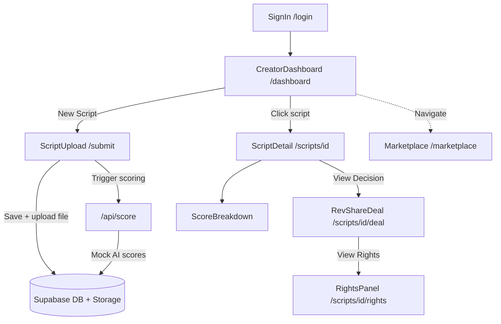

# Bullet Studios -- Script Scoring Prototype Plan

## 1. Goal & Scope

Build a working prototype for the **Bullet Studios script scoring flow** -- the end-to-end creator journey from script submission through AI scoring to decision and marketplace visibility.

This prototype optimizes for:
- **Speed of iteration** -- rapid "vibe coding" to prove the concept
- **Clarity of UX** -- clean, intuitive states for creators at every step
- **Technical believability** -- real database, real auth, realistic scoring logic

## 2. Tech Stack & Architecture

| Layer | Choice |
|-------|--------|
| Framework | Next.js 16 (App Router) + TypeScript |
| Styling | Tailwind CSS + custom dark theme |
| Icons | Lucide React |
| Backend / DB | Supabase (Postgres + Auth + Storage) |
| AI Scoring | Mock API route with weighted random sub-scores |
| Deployment | Vercel |

### Architecture Diagram

## 3. Data Model (Supabase)

**`scripts` table**

| Column | Type | Notes |
|--------|------|-------|
| id | uuid (PK) | Auto-generated |
| user_id | uuid (FK to auth.users) | Row-level security |
| title | text | Required |
| description | text | Logline |
| content | text | Pasted script text |
| file_url | text | Supabase Storage URL |
| genre | text | Thriller, Romance, etc. |
| tags | text[] | Free-form tag chips |
| status | text | analyzing / scored / deal_offered |
| overall_score | integer | 0-100 |
| plot_score | integer | 0-100 |
| pacing_score | integer | 0-100 |
| hook_score | integer | 0-100 |
| characters_score | integer | 0-100 |
| dialogue_score | integer | 0-100 |
| binge_factor_score | integer | 0-100 |
| decision | text | rights_purchase / revenue_share / marketplace / feedback |
| good_feedback | jsonb | Array of { title, description } |
| improvement_feedback | jsonb | Array of { title, description } |
| created_at | timestamptz | Default now() |

Row Level Security ensures users can only see and edit their own scripts, with marketplace scripts visible to all.

## 4. Screens Implemented

### 1. Sign In & Sign Up (`/login`, `/signup`)
- Real Supabase email/password auth
- Clean dark-themed forms matching the brand
- Middleware redirects unauthenticated users to login

### 2. Creator Dashboard (`/dashboard`)
- Stats bar: Total Scripts, Analyzing, Scored, Deals Offered
- Script cards with title, description, genre, date, status badge, and score
- Filter tabs: All, Analyzing, Scored, Deal Offered, In Marketplace
- Empty state with CTA to submit first script
- Skeleton loading states

### 3. Script Upload (`/submit`)
- Form: title, logline, genre selector, tag chips, file upload area
- Drag-and-drop file upload (PDF, DOC, TXT up to 10MB)
- Files stored in Supabase Storage
- On submit: saves to DB, triggers mock scoring, redirects to detail page

### 4. AI Analysis Result (`/scripts/[id]`)
- Animated "analyzing" state with bouncing dots while scoring runs
- Auto-polls for score results every 2 seconds
- Overall score display with label (Exceptional / Great / Good / etc.)
- Six animated score bars: Plot, Pacing, Hook, Characters, Dialogue, Binge Factor
- "What's Good" section with positive highlights
- "What Can Be Improved" section with constructive feedback
- "View Decision" CTA linking to the deal page

### 5. Revenue Share Deal (`/scripts/[id]/deal`)
- Score display with script title
- Revenue share terms: 60/40 split, minimum guarantee, duration, payment schedule
- "Accept Deal" button with confirmation state
- "View Rights" button linking to rights panel

### 6. Rights Availability (`/scripts/[id]/rights`)
- Overview: rights owned vs available vs total
- Rights Owned list (Digital Distribution India, Remake Rights Hindi)
- Rights Available list with "Inquire" buttons
- Inquiry confirmation state

### 7. Script Marketplace (`/marketplace`)
- Search bar filtering by title, description, genre, and tags
- Script cards with score, genre, description, tags, and rights availability
- Pre-populated with sample marketplace scripts
- Also shows any user scripts that scored into the 70-79 marketplace tier

## 5. Mock AI Scoring Logic

The scoring API route (`/api/score`):
1. Receives a script ID
2. Waits 2-4 seconds (simulated AI processing)
3. Generates weighted random sub-scores across 6 dimensions
4. Computes overall score as weighted average (Plot 20%, Hook 20%, Characters 18%, Pacing 15%, Binge Factor 15%, Dialogue 12%)
5. Determines decision tier based on overall score
6. Generates contextual "What's Good" and "What Can Be Improved" feedback
7. Updates the script record in Supabase

## 6. Design Decisions & Tradeoffs

- **Mock scoring vs OpenAI**: Chose mock scoring for reliability and zero API key dependency. The API surface is designed so it could be swapped with a real OpenAI call without changing any UI code.
- **Single decision screen**: Only the Revenue Share deal screen is fully built (80-89 tier), as specified. Other tiers show scores and feedback but don't have dedicated deal pages.
- **Dark theme**: Matches Bullet Shorts' brand identity (dark backgrounds, vibrant accents).
- **Middleware auth**: Real auth protection ensures the prototype feels like a production app, not just a static demo.
- **Sample marketplace data**: The marketplace includes hardcoded sample scripts alongside any real user scripts that score into the 70-79 range, ensuring the page always has content to show.
